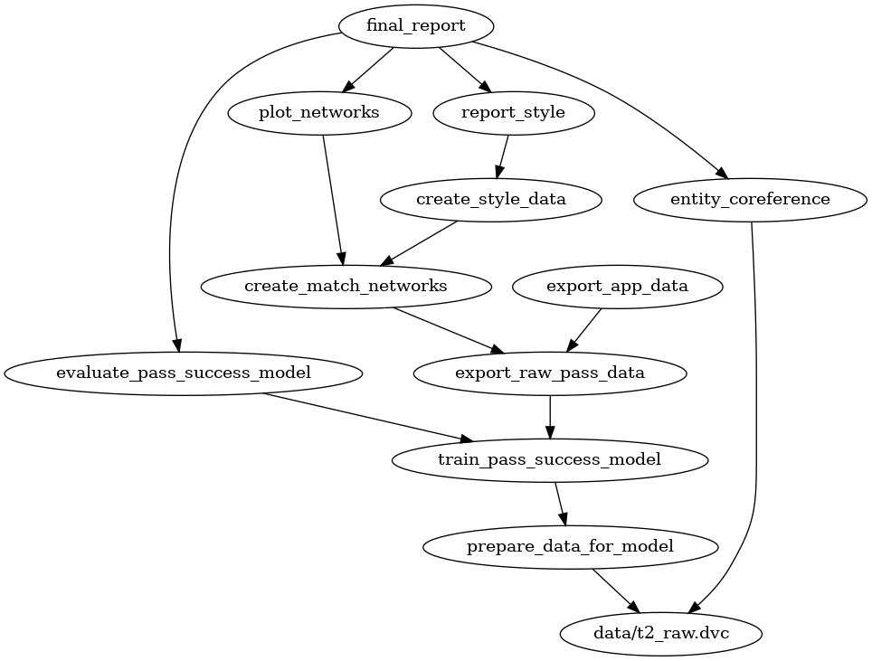

# Public repository for event level football data based research projects

With [Gianmarco Ottaviano](https://sites.google.com/view/gipottaviano) 
(Bocconi University) and 
[Gábor Békés](https://sites.google.com/site/bekesg/) (CEU)

## Report

A [report](reports/main_report.md) of the results is generated
in the last, `final_report` step of the dag

## Processing

The following [dvc](https://dvc.org/) DAG can be rerun using `dvc repro`
 and all necessary data can be downloaded using `dvc pull` 
 (edge directions show dependency)

the code for all elements of the pipeline can be tracked as instances of 
`src.dvc_util.PipelineElement` in the src module. 

## Data Sources

All transferred from a raw T1 data-collection and initial cleaning
step to a T2 tabular, tidy form in `data/t2_raw` serialized to parquet

- event feed focused [Opta data](https://www.docdroid.net/ymMGPRQ/opta-playground-f24-documentation-pdf) 
  - `wh_season_df`, `wh_team_df`, `formation_df`, `wh_player_df`, `formation_use_df`, `match_df`, `attendance_df`
- community driven estimated market values and player info from [transfermarkt](https://www.transfermarkt.com/)
  - `tm_lineups`, `tm_matches`, `tm_player_df`, `mv_df`, `transfer_df`
- organization and player injury data from [soccerway](https://uk.soccerway.com/)
- odds data from [oddsportal](https://www.oddsportal.com/)

presented in this public repo is a sample dataset based on the scope of
[this set](https://figshare.com/collections/Soccer_match_event_dataset/4415000/5)

