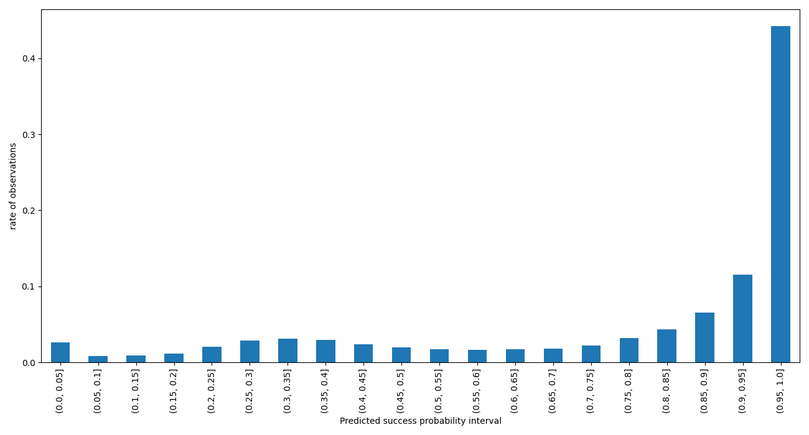

# Report

`final_report` dvc step creates this report 
and all figures and tables used by it

## Model
In the `train_pass_success_model` step, a boosted tree model is trained 
on selected features of the event data to estimate expected success 
of a pass.

### Features

(with hopefully sufficiently self explanitory names)

- boolean qualifiers
  - `longball`, `headpass`, `throwin`, `chipped`, `cross`, `cornertaken`, `freekicktaken`, `layoff`, `indirectfreekicktaken`, `throughball`, `keeperthrow`, `goalkick`
- categorical variables
  - `period`, `event_side`, `pass_direction_cat`
- numeric variables
  - `x`, `y`, `passendy`, `passendx`, `length`, `distance_from_opp_goal`, `distance_from_own_goal`, `minute`

### Model performance

The model is evaluated on a test set 
in the `evaluate_pass_success_model` step

The output of the model is intended to extend pass data
 with estimated riskiness of a pass. 
 So although it is worth noting that the confusion 
matrix and point metrics show that these variables predict the success of a 
pass quite well, more in depth look at the predicted probabilities is needed

#### Confusion matrix

#### Point metrics

<table border="1" class="dataframe">
  <thead>
    <tr style="text-align: right;">
      <th></th>
      <th>value</th>
    </tr>
  </thead>
  <tbody>
    <tr>
      <th>accuracy</th>
      <td>0.869118</td>
    </tr>
    <tr>
      <th>recall</th>
      <td>0.929158</td>
    </tr>
    <tr>
      <th>f1</th>
      <td>0.916511</td>
    </tr>
    <tr>
      <th>brier</th>
      <td>0.092654</td>
    </tr>
  </tbody>
</table>

One way to assess prediction probabilities is the ROC curve, which 
is also sufficiently promising with an AUC of over 90%

#### ROC

To have a more complete look at the prediction probabilities is to create
subsets of the test set based on bins of prediction probabilities. 
Here, we can see that nearly half of all passes are predicted to 
succeed with over 90% chance. However the predictions can still be used
to create subsets of of passes where the success rate is very close to 
the mean of predicted probability. 

#### Predicted success bins

These metrics and figures should be sufficient to conclude that the model
meaningfully extends the data with estimated pass riskiness

### Determinants of pass success

Looking at [shap](https://github.com/slundberg/shap) generated values
for impact on predicted success, the most important determinants of 
success of a pass apper to be its target location, direction as lenght. 
These align with the expectations that passes targeting places closer 
to the opposition goal and forward passes are riskier than backward passes
far from the opposition goal.

## Network

Networks are created based on pass events in the games, 
in the `create-match-networks` step.
Pass targets are not straightforward, as they are not recorded. 
A specific `player_with_next_touch` variable is created for all passes,
where the chronologically next touch event is found, for successful passes

### Network Types
Three types of networks are created for every game. Specific for the 
home and away sides and the formations they played in the game.
These networks are based on the passes attempted when the team played 
in the formation the graph is based on.

(in the sample graph plots, the nodes are placed based on the mean source 
location of pass attempts)
 
- `field_zone` based, where sources and targets represent one specific 
 third of the field in either direction, splitting the pitch to 9 equal sized
 areas. (this is the only type of graph that includes unsuccessful passes, as 
 pass end location is recorded for incomplete passes as well, but pass target 
 player is not)

- `formation_slot` based, where sources and targets represent a slot in the 
 teams formation. in this example, `spot_2` is the right wing-back position 
 in 3-5-2 
 filled in the game by Kyle Walker 
 (as seen in the next figure)

- `player` based, where sources and targets are simply players

### Edge Attributes

As each edge represents a set of passes a number of metrics are available describing 
that set.

For each edge we know:

- number of passes, categorized by
  - general category:
    - longball, headpass, throwin, chipped, cross, cornertaken, 
    freekicktaken, layoff, indirectfreekicktaken, throughball, 
    keeperthrow, goalkick, is_success
  - attempted in first half / second half
  - pass direction left/right/forward/backward
  - source and target formation slots and field zones
  - predicted success bin
    - (0, 0.1], (0.1, 0.2], (0.2, 0.3], ... , (0.9, 1]
    - this is supposed to indicate the riskyness of passes
- mean statistics for passes:
  - pass start location (x, y), pass end location, (passendy, passendx)
  - length, start distance from opposition goal, distance from own goal
  - attempt minute
  - predicted success probability

## Style

Based on the networks created for each game, a wide range of possible
style metrics could be calculated for a team playing in a formation.

I will present just one here.

### Rigidity

Lets define a broad basis for the rigidity of a teams 
performance in a match:

> A performance is rigid, if the passing patterns of the team 
> can be discovered to follow a fairly simple  algorithm

In this concrete rigidity metric, the algorithm is:

> If player X finds himself with tha ball in field zone Z
> look to pass to another player playing in S position of the formation

An estimate about how strictly a teams passing pattern follows this
 algorithm can be made, using data about successful passes from 
 specific field zones to different formation slots.

Take the following match

<table border="1" class="dataframe">
  <thead>
    <tr style="text-align: right;">
      <th></th>
      <th>wh_match_id</th>
      <th>home_team</th>
      <th>away_team</th>
      <th>fulltime_score</th>
      <th>date</th>
    </tr>
  </thead>
  <tbody>
    <tr>
      <th>0</th>
      <td>1190306</td>
      <td>Huddersfield</td>
      <td>Man City</td>
      <td>1 : 2</td>
      <td>2017-11-26</td>
    </tr>
  </tbody>
</table>

On example of the away teams passes originating in one zone, 
distributed across formation slots

<table border="1" class="dataframe">
  <thead>
    <tr style="text-align: right;">
      <th></th>
      <th>source</th>
      <th>target</th>
      <th>successful passes</th>
    </tr>
  </thead>
  <tbody>
    <tr>
      <th>0</th>
      <td>1-0</td>
      <td>spot_1</td>
      <td>0.0</td>
    </tr>
    <tr>
      <th>1</th>
      <td>1-0</td>
      <td>spot_10</td>
      <td>11.0</td>
    </tr>
    <tr>
      <th>2</th>
      <td>1-0</td>
      <td>spot_11</td>
      <td>1.0</td>
    </tr>
    <tr>
      <th>3</th>
      <td>1-0</td>
      <td>spot_2</td>
      <td>17.0</td>
    </tr>
    <tr>
      <th>4</th>
      <td>1-0</td>
      <td>spot_3</td>
      <td>2.0</td>
    </tr>
    <tr>
      <th>5</th>
      <td>1-0</td>
      <td>spot_4</td>
      <td>10.0</td>
    </tr>
    <tr>
      <th>6</th>
      <td>1-0</td>
      <td>spot_5</td>
      <td>12.0</td>
    </tr>
    <tr>
      <th>7</th>
      <td>1-0</td>
      <td>spot_6</td>
      <td>24.0</td>
    </tr>
    <tr>
      <th>8</th>
      <td>1-0</td>
      <td>spot_7</td>
      <td>13.0</td>
    </tr>
    <tr>
      <th>9</th>
      <td>1-0</td>
      <td>spot_8</td>
      <td>10.0</td>
    </tr>
    <tr>
      <th>10</th>
      <td>1-0</td>
      <td>spot_9</td>
      <td>4.0</td>
    </tr>
  </tbody>
</table>

this gives a gini coefficient of X. 
calculating this gini coefficient 
for all source zones gives the following table

<table border="1" class="dataframe">
  <thead>
    <tr style="text-align: right;">
      <th></th>
      <th>side</th>
      <th>source</th>
      <th>formation</th>
      <th>is_success</th>
      <th>gini</th>
    </tr>
  </thead>
  <tbody>
    <tr>
      <th>0</th>
      <td>away</td>
      <td>0-0</td>
      <td>433</td>
      <td>16.0</td>
      <td>0.675325</td>
    </tr>
    <tr>
      <th>1</th>
      <td>away</td>
      <td>0-1</td>
      <td>433</td>
      <td>43.0</td>
      <td>0.376623</td>
    </tr>
    <tr>
      <th>2</th>
      <td>away</td>
      <td>0-2</td>
      <td>433</td>
      <td>32.0</td>
      <td>0.480938</td>
    </tr>
    <tr>
      <th>3</th>
      <td>away</td>
      <td>1-0</td>
      <td>433</td>
      <td>108.0</td>
      <td>0.409091</td>
    </tr>
    <tr>
      <th>4</th>
      <td>away</td>
      <td>1-1</td>
      <td>433</td>
      <td>176.0</td>
      <td>0.354286</td>
    </tr>
    <tr>
      <th>5</th>
      <td>away</td>
      <td>1-2</td>
      <td>433</td>
      <td>99.0</td>
      <td>0.539831</td>
    </tr>
    <tr>
      <th>6</th>
      <td>away</td>
      <td>2-0</td>
      <td>433</td>
      <td>87.0</td>
      <td>0.484144</td>
    </tr>
    <tr>
      <th>7</th>
      <td>away</td>
      <td>2-1</td>
      <td>433</td>
      <td>52.0</td>
      <td>0.430070</td>
    </tr>
    <tr>
      <th>8</th>
      <td>away</td>
      <td>2-2</td>
      <td>433</td>
      <td>51.0</td>
      <td>0.527629</td>
    </tr>
    <tr>
      <th>9</th>
      <td>home</td>
      <td>0-0</td>
      <td>451</td>
      <td>8.0</td>
      <td>0.750000</td>
    </tr>
    <tr>
      <th>10</th>
      <td>home</td>
      <td>0-1</td>
      <td>451</td>
      <td>19.0</td>
      <td>0.565657</td>
    </tr>
    <tr>
      <th>11</th>
      <td>home</td>
      <td>0-2</td>
      <td>451</td>
      <td>11.0</td>
      <td>0.595041</td>
    </tr>
    <tr>
      <th>12</th>
      <td>home</td>
      <td>1-0</td>
      <td>451</td>
      <td>18.0</td>
      <td>0.460606</td>
    </tr>
    <tr>
      <th>13</th>
      <td>home</td>
      <td>1-1</td>
      <td>451</td>
      <td>15.0</td>
      <td>0.517483</td>
    </tr>
    <tr>
      <th>14</th>
      <td>home</td>
      <td>1-2</td>
      <td>4411</td>
      <td>1.0</td>
      <td>0.909091</td>
    </tr>
    <tr>
      <th>15</th>
      <td>home</td>
      <td>1-2</td>
      <td>451</td>
      <td>13.0</td>
      <td>0.512397</td>
    </tr>
    <tr>
      <th>16</th>
      <td>home</td>
      <td>2-0</td>
      <td>4411</td>
      <td>0.0</td>
      <td>NaN</td>
    </tr>
    <tr>
      <th>17</th>
      <td>home</td>
      <td>2-0</td>
      <td>451</td>
      <td>18.0</td>
      <td>0.556150</td>
    </tr>
    <tr>
      <th>18</th>
      <td>home</td>
      <td>2-1</td>
      <td>4411</td>
      <td>0.0</td>
      <td>NaN</td>
    </tr>
    <tr>
      <th>19</th>
      <td>home</td>
      <td>2-1</td>
      <td>451</td>
      <td>1.0</td>
      <td>0.909091</td>
    </tr>
    <tr>
      <th>20</th>
      <td>home</td>
      <td>2-2</td>
      <td>451</td>
      <td>7.0</td>
      <td>0.623377</td>
    </tr>
  </tbody>
</table>

which gives a weighted average

<table border="1" class="dataframe">
  <thead>
    <tr style="text-align: right;">
      <th></th>
      <th>side</th>
      <th>weighted means of ginis --&gt; rigidity</th>
      <th>pass success rate</th>
    </tr>
  </thead>
  <tbody>
    <tr>
      <th>0</th>
      <td>away</td>
      <td>0.442414</td>
      <td>0.864583</td>
    </tr>
    <tr>
      <th>1</th>
      <td>home</td>
      <td>0.560358</td>
      <td>0.523585</td>
    </tr>
  </tbody>
</table>

## Success Association

Turns out the above defined rigidity of a teams performance
can be associated with its success, based on the opposition.

## Association to causation

## Entity Coreference

## Pipeline
